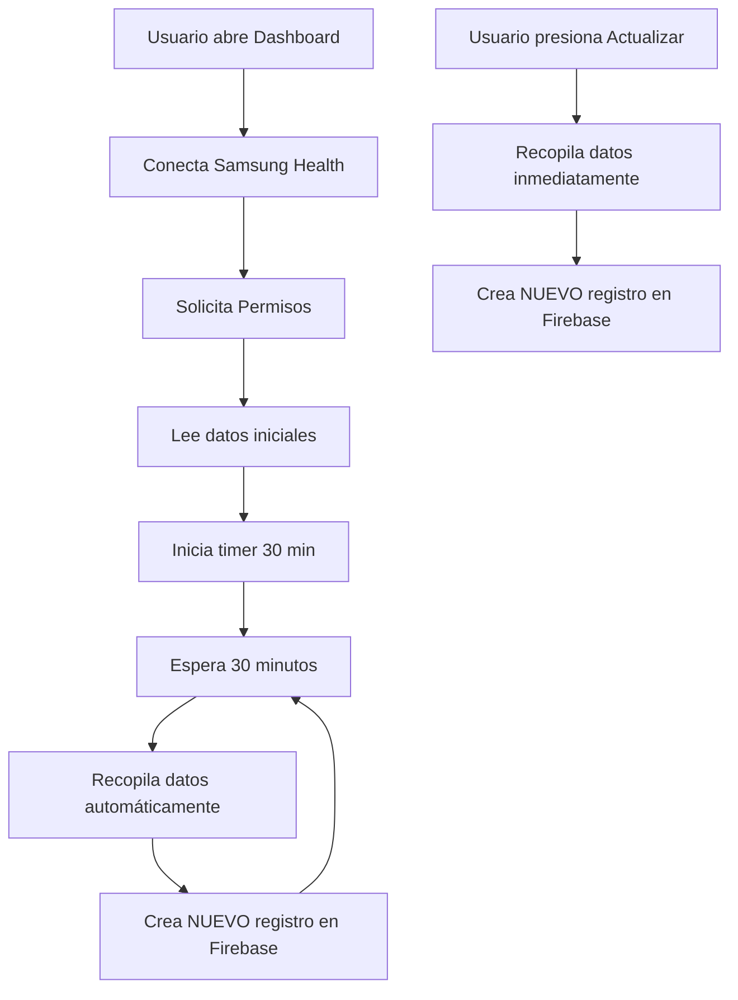

# 📊 Sistema de Recopilación Automática de Datos de Salud

## ✅ Cambios Implementados

### 🔄 **Recopilación Automática Cada 30 Minutos**

El sistema ahora recopila datos de salud automáticamente sin necesidad de presionar botones:

```kotlin
// Configuración
private val autoCollectInterval = 30 * 60 * 1000L // 30 minutos
```

**Características:**
- ⏰ Inicia automáticamente al abrir el Dashboard
- 🔄 Se ejecuta cada 30 minutos en segundo plano
- 💾 Crea un NUEVO registro cada vez
- 📱 Funciona mientras la app está activa

### 📝 **Nuevo Sistema de Registros**

Antes cada actualización sobrescribía el registro del día. **Ahora cada recopilación crea un registro único:**

#### Estructura Anterior (❌ Ya no se usa):
```
users/{userId}/daily_health_data/{fecha}
```

#### Nueva Estructura (✅ Actual):
```
users/{userId}/health_records/{fecha}_{timestamp}
```

**Ejemplo de IDs de documentos:**
```
2025-10-25_1729850400000
2025-10-25_1729852200000  // 30 minutos después
2025-10-25_1729854000000  // 30 minutos después
```

### 💾 **Datos Guardados en Cada Registro**

Cada documento contiene:
```json
{
  "pasosDiarios": 8500,
  "horasDeSueño": 7.5,
  "tiempoPantalla": 0.0,
  "frecuenciaCardiaca": 72,
  "frecuenciaCardiacaMax": 95,
  "frecuenciaCardiacaMin": 58,
  "relojColocado": true,
  "nivelDeEstres": 20,
  "horaRegistro": "14:30",
  "fecha": "2025-10-25",
  "peso": 70.0,
  "altura": 1.75,
  "timestamp": 1729850400000,
  "createdAt": "Fri Oct 25 2025 14:30:00"
}
```

## 🎯 Formas de Recopilar Datos

### 1️⃣ **Automático (cada 30 minutos)**
- Se ejecuta en segundo plano
- No requiere interacción del usuario
- Mensaje: `"⏰ Recopilación automática de datos cada 30 minutos"`

### 2️⃣ **Manual (botón Actualizar)**
- El usuario presiona "Actualizar"
- Crea inmediatamente un nuevo registro
- Útil cuando quieres capturar el momento exacto

### 3️⃣ **Inicial (al conectar)**
- Cuando Samsung Health se conecta correctamente
- Lee los datos una vez al inicio

## 📱 Flujo de Funcionamiento



## 🔍 Verificar en Firebase

### Ver todos los registros de un usuario:

1. Abre Firebase Console
2. Ve a Firestore Database
3. Navega a: `users/{userId}/health_records/`
4. Verás múltiples documentos con este formato:
   ```
   📄 2025-10-25_1729850400000
   📄 2025-10-25_1729852200000
   📄 2025-10-25_1729854000000
   ...
   ```

### Consultar registros por fecha:

```javascript
// Obtener todos los registros del 25 de octubre
db.collection('users').doc(userId)
  .collection('health_records')
  .where('fecha', '==', '2025-10-25')
  .orderBy('timestamp', 'desc')
  .get()
```

### Consultar registros de las últimas 24 horas:

```javascript
const yesterday = Date.now() - (24 * 60 * 60 * 1000);

db.collection('users').doc(userId)
  .collection('health_records')
  .where('timestamp', '>=', yesterday)
  .orderBy('timestamp', 'desc')
  .get()
```

## 📊 Ventajas del Nuevo Sistema

| Característica | Antes | Ahora |
|----------------|-------|-------|
| Registros por día | 1 | Ilimitados (cada 30 min) |
| Actualización | Sobrescribe | Crea nuevo |
| Historial | Limitado | Completo |
| Análisis temporal | Difícil | Fácil |
| Datos perdidos si falla | Sí | No |

## 🎨 Mensajes en la UI

### Al iniciar:
```
📢 Bienvenido
Dashboard de salud activo! Los datos se recopilarán automáticamente 
cada 30 minutos. Presiona 'Actualizar' para crear un nuevo registro ahora.
```

### Al iniciar recopilación automática:
```
🔄 Recopilación Automática
Los datos de salud se recopilarán automáticamente cada 30 minutos
```

### Al guardar registro:
```
✅ Nuevo Registro Creado
Registro #1729850400000 guardado: 2025-10-25 a las 14:30
```

## ⚙️ Configuración

### Cambiar el intervalo de recopilación:

Edita en `DashboardActivity.kt`:

```kotlin
// Para 15 minutos:
private val autoCollectInterval = 15 * 60 * 1000L

// Para 1 hora:
private val autoCollectInterval = 60 * 60 * 1000L

// Para 5 minutos (testing):
private val autoCollectInterval = 5 * 60 * 1000L
```

## 🧪 Testing

### Probar recopilación automática:

1. **Cambiar a intervalo corto (5 minutos):**
   ```kotlin
   private val autoCollectInterval = 5 * 60 * 1000L
   ```

2. **Compilar e instalar:**
   ```bash
   .\gradlew installDebug
   ```

3. **Ver logs:**
   ```bash
   adb logcat -s SamsungHealthApp
   ```

4. **Buscar en logs:**
   ```
   SamsungHealthApp: 🔄 Iniciando recopilación automática cada 30 minutos
   SamsungHealthApp: ⏰ Recopilación automática de datos cada 30 minutos
   SamsungHealthApp: 💾 Guardando NUEVO registro de salud en Firebase con ID: ...
   SamsungHealthApp: ✅ Nuevo registro de salud guardado exitosamente: ...
   ```

## 🛑 Importante

### El timer se detiene cuando:
- ❌ Usuario cierra la app
- ❌ Usuario hace logout
- ❌ Sistema mata el proceso

### El timer continúa cuando:
- ✅ App está en background
- ✅ Pantalla apagada (si app activa)
- ✅ Usuario cambia de activity y vuelve

## 📈 Análisis de Datos

Con este sistema puedes hacer:

### 1. Gráficas de progreso diario
```javascript
// Obtener todos los registros de un día
// Graficar frecuencia cardíaca vs tiempo
```

### 2. Comparar datos entre días
```javascript
// Comparar pasos entre lunes y martes
```

### 3. Detectar patrones
```javascript
// Ver cuándo el nivel de estrés es más alto
// Correlacionar sueño con frecuencia cardíaca
```

### 4. Alertas inteligentes
```javascript
// Si frecuencia cardíaca sube mucho
// Si nivel de estrés es alto consistentemente
```

## 🚀 Próximos Pasos Sugeridos

1. **Implementar vista de historial:**
   - Mostrar todos los registros del día
   - Gráfica de tendencias

2. **Notificaciones:**
   - Alertar si valores anormales
   - Recordar revisar el dashboard

3. **Exportar datos:**
   - CSV para análisis
   - PDF para compartir con médico

4. **Sincronización offline:**
   - Guardar localmente si no hay internet
   - Subir cuando se recupere conexión

---

**Estado:** ✅ Sistema de recopilación automática implementado y funcionando
**Compilación:** ✅ Exitosa
**Firebase:** ✅ Crea nuevo registro cada vez (no sobrescribe)
**Timer:** ✅ Cada 30 minutos automáticamente
